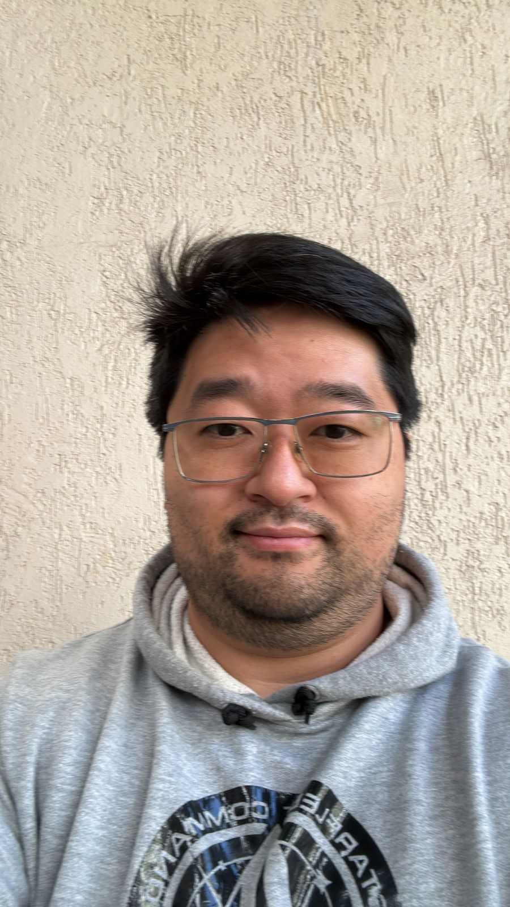
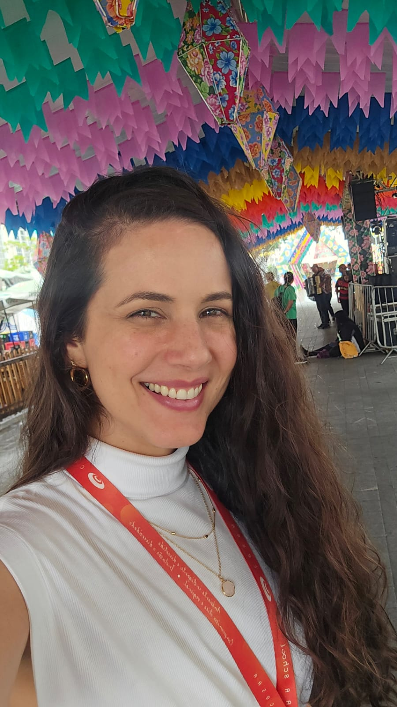
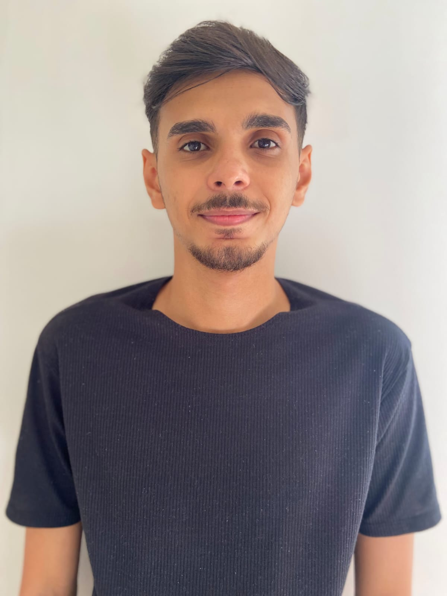
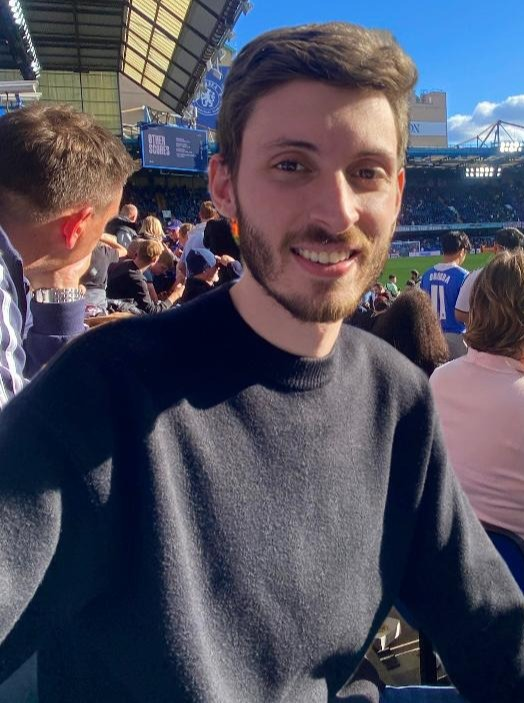

<table>
  <tr>
      <td width="200" align="right">
      
    </td>
    <td>

# BRIDGE-LAB  
**Building Research in Development, Growth, and Education**

Welcome to the official repository of **BRIDGE-LAB**, an interdisciplinary research group dedicated to exploring how software engineering, corporate computing education, responsible AI, the use of AI in software development processes, and inclusive design can support human well-being and technological growth.

</td>

  </tr>
</table>

## 🧠 Who We Are

BRIDGE-LAB brings together researchers and graduate students working at the intersection of: Human-centered Software Engineering, Corporate Computing Education, Future of Work (with AI) and Accessibility and Neurodivergent Inclusion. We aim to generate practical, evidence-based insights to foster better tools, teams, and technologies across academia and industry.

## 🔬 Research Areas

- **Human-centered Software Engineering**: We study how developers interact with tools, teams, and processes, focusing on productivity, usability, and well-being.

- **Corporate Computing Education**: We evaluate and design training programs to improve how companies prepare and develop their technical teams.

- **Future of Work (with AI)**: We investigate how AI is reshaping work environments, roles, and decision-making in the software industry.

- **Accessibility and Neurodivergent Inclusion**: We explore how technology can be made more inclusive, focusing on participatory design and accessibility for neurodivergent professionals.
---

### 👥 Researchers

<table>
  <tr> ## Leader
    <td width="120"></td>
    <td>
      <strong>Danilo Monteiro Ribeiro</strong> – <em>Lead Researcher</em>  
      [<a href="https://www.linkedin.com/in/prof-danilo-monteiro/">LinkedIn</a>] • [<a href="https://github.com/dan1lo">GitHub</a>] 
      Research Fellow at ZUP Innovation and Professor at CESAR School. Leads applied research on AI-powered developer tools and collaborates with HR to foster learning and well-being through data. Conducts applied research to create practical, evidence-based models for corporate computing education.  
      His work focuses on human-centered software engineering, corporate computing education, responsible AI, and accessibility for neurodivergent individuals.
    </td>
  </table>
  
👨‍🎓 PhD Candidates
<table>
  <tr>
    <td width="120"></td>
    <td>
      <strong>Antonio Oliveira</strong>  
      [<a href="https://linkedin.com/in/aaspo">LinkedIn</a>] 
     Engineer at Software Mind and PhD candidate at CESAR School. Research AI’s impact on teaching and learning in IT disciplines to design data-driven strategies in Computer Science education.
    </td>
  </tr>

  <tr>
    <td></td>
    <td>
      <strong>Marcelo Franco</strong> 
      COO at Specialisterne and senior researcher at Dell’s LEAD Center. PhD candidate researching participatory design and accessibility for neurodivergent users in HCI.
    </td>
  </tr>

  <tr>
    <td></td>
    <td>
      <strong>Gilberto Hida</strong>  
      [<a href="https://br.linkedin.com/in/gilbertohida">LinkedIn</a>] 
      Data Scientist at Hospital Israelita Albert Einstein and PhD candidate at CESAR School. Researches the use of AI to support systematic studies in software engineering, especially screening and evidence extraction.
    </td>
  </tr>
</table>

---

## 🎓 Master’s Candidates

<table>
  <tr>
    <td width="120"></td>
    <td>
      <strong>Lidiane Gomes</strong>  
      [<a href="https://www.linkedin.com/in/lidiane-gomes-47163735/">LinkedIn</a>] 
      Project Manager at CMTECH. Researches effectiveness of technical training and how managers assess developer performance.
    </td>
  </tr>
    <tr>
    <td></td>
    <td>
      <strong>Erika Spadetto</strong>  
      [<a href="https://www.linkedin.com/in/ericaspadeto">LinkedIn</a>] 
      Software Engineering Manager at SBF Group. Master’s student at CESAR School researching the use of artificial intelligence in software engineering management.
    </td>
  </tr>

  <tr>
    <td></td>
    <td>
      <strong>Rafael Corrêa Lopes</strong> 
      Lead Game Producer at Kokku. Investigates the role and competencies of Game Producers in the industry.
    </td>
  </tr>

  <tr>
    <td></td>
    <td>
      <strong>Rodrigo Siqueira</strong> 
      Frontend Chapter Leader and Software Engineer. Researches how corporate education influences collaboration and quality in dev teams.
    </td>
  </tr>

  <tr>
    <td></td>
    <td>
      <strong>Breno Alves</strong> 
      Team Lead at Serasa Experian. Studies how corporate training affects software development performance.
    </td>
  </tr>

  <tr>
    <td></td>
    <td>
      <strong>Emily Magalhães</strong> 
      Software Development Engineer in Test at Avalara Brazil. Focuses on test automation and reliability in the context of training.
    </td>
  </tr>
</table>

---

## 👨‍💻 Undergraduate Students

<table>
  <tr>
    <td width="120"></td>
    <td>
      <strong>Jean Mendonça</strong>  
      [<a href="https://www.linkedin.com/in/jean-mendonca/">LinkedIn</a>] 
      Mid-level Test Engineer at Accenture with 5+ years of experience. Undergraduate student at CESAR School researching how Generative AI (GenAI) is transforming the work of test engineers.
    </td>
  </tr>

  <tr>
    <td></td>
    <td>
      <strong>Pedro Andriotti</strong>  
      [<a href="https://www.linkedin.com/in/pedroandriotti/">LinkedIn</a>] 
      Software Engineer at BR Consulting and CEO of Home Link. Undergraduate student at CESAR School researching how AI is used by interns in their first software development roles. Passionate about clean architecture, reliability, and user-centric design.
    </td>
  </tr>
</table>
</table>

---

 

---

## 📄 Publications

Our research group is committed to producing impactful studies in the fields of computing education, human-centered software engineering, and game development. Below are some of our recent publications:

- **Breno Alves de Andrade, Rodrigo Siqueira, Lidiane Gomes, Antonio Oliveira, Danilo Monteiro Ribeiro.**  
  [*A Mapping Study About Training in Industry Context in Software Engineering*](https://arxiv.org/abs/2506.12590)  
  **SBES - Brazilian Symposium on Software Engineering (Track: Education)**, 2025.

- **Rafael C. Lopes, Danilo M. Ribeiro.**  
  [*Defining the Game Producer: A Mapping of Key Characteristics and Differentiators of the Professional Behind Digital Game Production*](https://arxiv.org/abs/2506.14409)  
  **SBGames - Brazilian Symposium on Games and Digital Entertainment**, 2025.

---

## 🔗 Contact

For collaboration opportunities or more information, contact the lead researcher:  
📧 [dmr@cesar.school](mailto:dmr@cesar.school)
