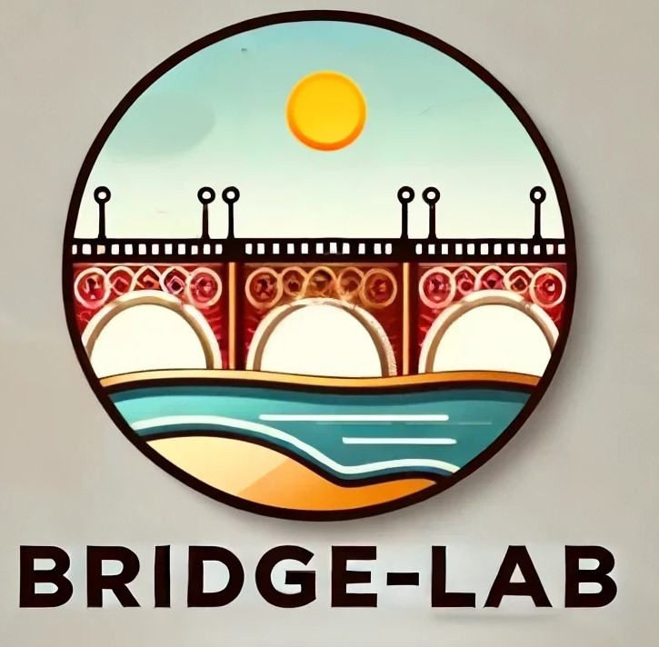
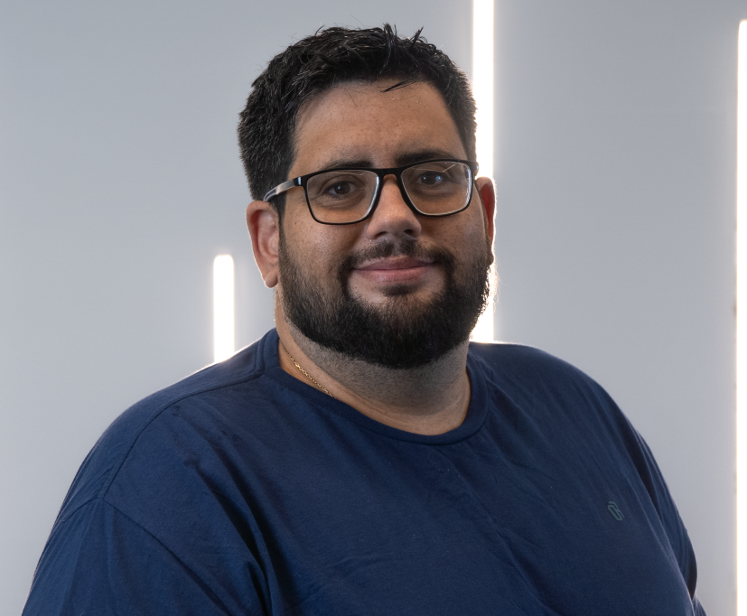
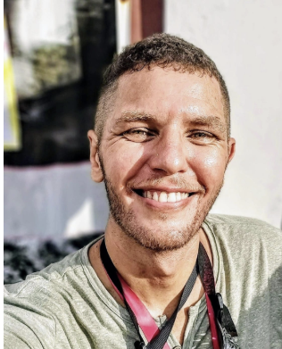
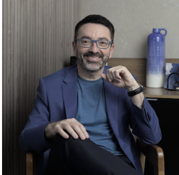
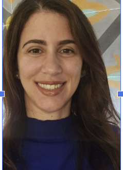
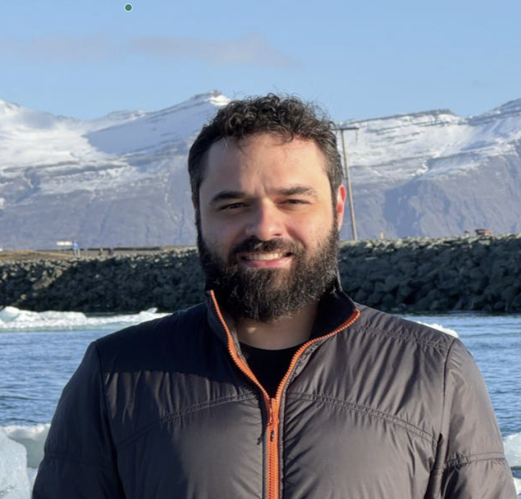
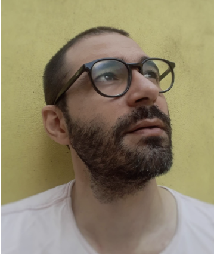
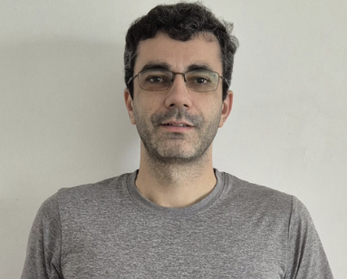

<table>
  <tr>
      <td width="200" align="right">
      
    </td>
    <td>

# BRIDGE-LAB  
**Building Research in Development, Growth, and Education**

Welcome to the official repository of **BRIDGE-LAB**, an interdisciplinary research group dedicated to exploring how software engineering, corporate computing education, responsible AI, the use of AI in software development processes, and inclusive design can support human well-being and technological growth.

</td>

  </tr>
</table>

## 🧠 Who We Are

BRIDGE-LAB brings together researchers, professionals, and students working at the intersection of:

- Human-centered Software Engineering  
- Corporate Training and Computing Education  
- Responsible Artificial Intelligence  
- Accessibility and Inclusion for Neurodivergent Individuals  

Our mission is to generate practical, evidence-based insights that empower developers, educators, and organizations to build better tools, teams, and technologies.

---

### 👥 Researchers

<table>
  <tr>
    <td width="120"></td>
    <td>
      <strong>Danilo Monteiro Ribeiro</strong> – <em>Lead Researcher</em>  
      [<a href="https://www.linkedin.com/in/prof-danilo-monteiro/">LinkedIn</a>] • [<a href="https://github.com/dan1lo">GitHub</a>] 
      Research Fellow at ZUP Innovation and Professor at CESAR School. Leads applied research on AI-powered developer tools and collaborates with HR to foster learning and well-being through data. Conducts applied research to create practical, evidence-based models for corporate computing education.  
      His work focuses on human-centered software engineering, corporate computing education, responsible AI, and accessibility for neurodivergent individuals.
    </td>
  </tr>

  <tr>
    <td></td>
    <td>
      <strong>Antonio Oliveira</strong> – <em>PhD Researcher</em>  
      [<a href="https://linkedin.com/in/aaspo">LinkedIn</a>] 
      QA Engineer at Software Mind, working with global stakeholders to implement validation strategies within agile environments.  
      PhD candidate at CESAR School researching data-driven strategies to evaluate and improve the effectiveness of corporate computing training. His research focuses on extracting and analyzing data from development repositories and system metrics.
    </td>
  </tr>

  <tr>
    <td></td>
    <td>
      <strong>Marcelo Franco</strong> – <em>PhD Researcher</em> 
      Cognitive psychologist and neuropsychologist. COO at Specialisterne and senior researcher at Dell’s LEAD Center. Professor in Human–Computer Interaction, accessibility, and applied neuroscience.  
      His PhD research at CESAR School explores participatory design frameworks aligned with neuro-inclusive software development.
    </td>
  </tr>

  <tr>
    <td></td>
    <td>
      <strong>Lidiane Gomes</strong> – <em>MSc Researcher</em>  
      [<a href="https://www.linkedin.com/in/lidiane-gomes-47163735/">LinkedIn</a>] 
      Project Manager at CMTECH, leading strategic technology initiatives with a focus on data governance, privacy frameworks, and systems for government agencies.  
      Master's student at CESAR School studying the effectiveness of technical training in software teams and how managers evaluate developer performance after training programs.
    </td>
  </tr>

  <tr>
    <td></td>
    <td>
      <strong>Rafael Corrêa Lopes</strong> – <em>MSc Researcher</em> 
      Lead Game Producer at Kokku. Master’s student at CESAR School researching the role, skills, and competencies of Game Producers. Brings experience in agile management, multidisciplinary team leadership, and research into production workflows.
    </td>
  </tr>

  <tr>
    <td></td>
    <td>
      <strong>Rodrigo Siqueira</strong> – <em>MSc Researcher</em> 
      Software Engineer and Frontend Chapter Leader with over 10 years of experience. Leads frontend technical growth through mentoring and best practices.  
      Master's student at CESAR School researching how corporate education impacts the performance and collaboration of software development teams.
    </td>
  </tr>

  <tr>
    <td></td>
    <td>
      <strong>Breno Alves</strong> – <em>MSc Researcher</em> 
      Software engineer and team leader at Serasa Experian. Over 10 years of experience in development and management. Master's student at CESAR School focusing on the effects of corporate training on team performance and strategic alignment.
    </td>
  </tr>

  <tr>
    <td></td>
    <td>
      <strong>Emily Magalhães</strong> – <em>MSc Researcher</em> 
      Software Development Engineer in Test at Avalara Brazil. Over a decade of experience in IT, with 7 years in automation. Holds a background in computer engineering and machine learning.  
      Master's student in Software Engineering focused on designing and implementing scalable automated testing strategies.
    </td>
  </tr>
</table>

---

## 🌍 Where We Are

Our members are based in Brazil, connected through partnerships with:
 

---

## 📄 Publications

Our research group is committed to producing impactful studies in the fields of computing education, human-centered software engineering, and game development. Below are some of our recent publications:

- **Breno Alves de Andrade, Rodrigo Siqueira, Lidiane Gomes, Antonio Oliveira, Danilo Monteiro Ribeiro.**  
  [*A Mapping Study About Training in Industry Context in Software Engineering*](https://arxiv.org/abs/2506.12590)  
  **SBES - Brazilian Symposium on Software Engineering (Track: Education)**, 2025.

- **Rafael C. Lopes, Danilo M. Ribeiro.**  
  [*Defining the Game Producer: A Mapping of Key Characteristics and Differentiators of the Professional Behind Digital Game Production*](https://arxiv.org/abs/2506.14409)  
  **SBGames - Brazilian Symposium on Games and Digital Entertainment**, 2025.

---

## 🔗 Contact

For collaboration opportunities or more information, contact the lead researcher:  
📧 [dmr@cesar.school](mailto:dmr@cesar.school)